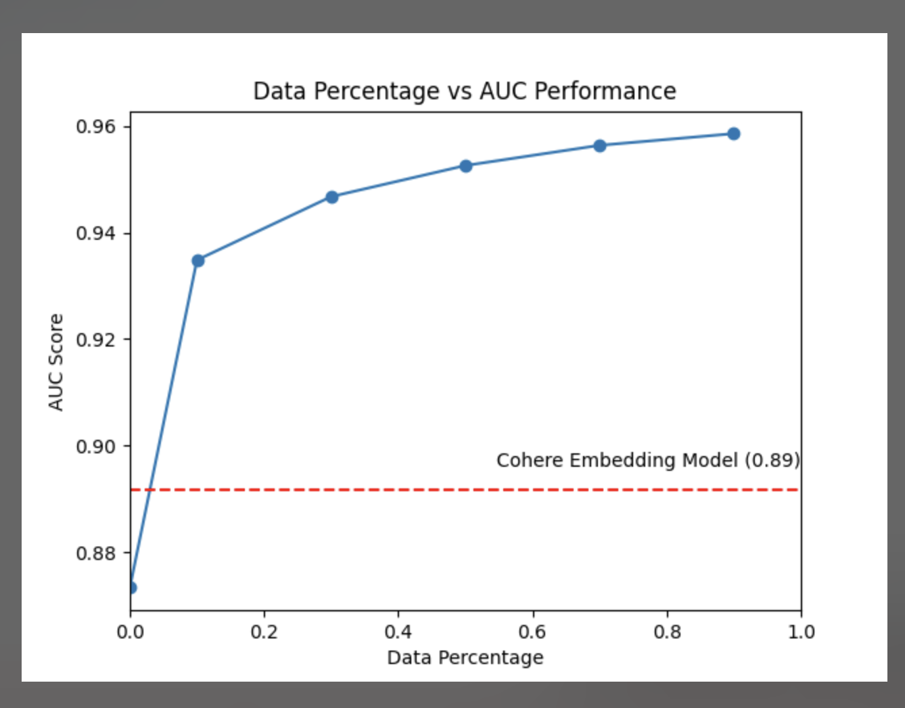

# Outline for Modal

## Introduction

- In the previous post we highlighted the value of embedding things very quickly.
- The idea being that if we can embed things quickly, we can experiment and iterate much faster through parallelism.

## Goal for this blog post

- The goal for this blog post is to showcase how fine-tuning could improve our model performance and how something like modal will allow us to experiment much more quickly.

- We're going to cover how to fine tune open models using sentence transformers.

## Should we really have to finetune?

- Here we're going to show an example of how we can use Embedding models to capture what's going on
- We'll show how the closed embeddings perform on the Quora similar item data set.
- Then we'll show how the open source models will perform.
- First we'll make a table of comparing AUC and accuracy for each model closed and open.

  - Cohere
  - OpenAI
  - Sentence Transformers

| Model                            | Accuracy   | AUC        |
| -------------------------------- | ---------- | ---------- |
| bge-base-en-v1.5                 | 0.8311     | 0.8566     |
| text-embedding-3-small (OpenAI)  | 0.8338     | 0.8612     |
| ember-v1                         | 0.8364     | **0.8640** |
| embed-multilingual-v3.0 (Cohere) | **0.8379** | 0.8619     |

## Finetuning results

- Then we'll show how as we fine-tune we can outperform closed models (which never improve)

This plot basically suggests that we can easily beat benchmarks if we have our own fine-tuning data set.

- For the most part we will not include the code for our benchmarks. It's part of the blog post, Instead we'll just try to provide some cookbooks. That should be pretty straight forward for anyone to use without trying to cover the abstractions on how to embed better or etc.

## Finetuning Sentence Transformers

- We'll just show how to do it with a single run.
- Would love some support here to better make use of modal labs (volumes and etc)
- https://www.sbert.net/examples/training/quora_duplicate_questions/README.html
- We'll just finetune one single model and show how it performs.

## What is Grid search?

- Here we should call out there's a bunch of different variables we shouldn't or have not tried
- Different loss functions, dimensionality, learning rates.
- We should also highlight that we could be finetuning many different models at once.

- models x n_dims x n_learning_rates x n_loss_functions \* dropout = many models!
- We should also highlight that we could be finetuning many different models at once using a simple map

## Conclusion

- I think we should leave Linear Adapter is out of this because we can use up the most compute with grid searching sentence transformers.

## Future work

- Linear Adapters, grid search
- Optuna or weight and biases for grid search
