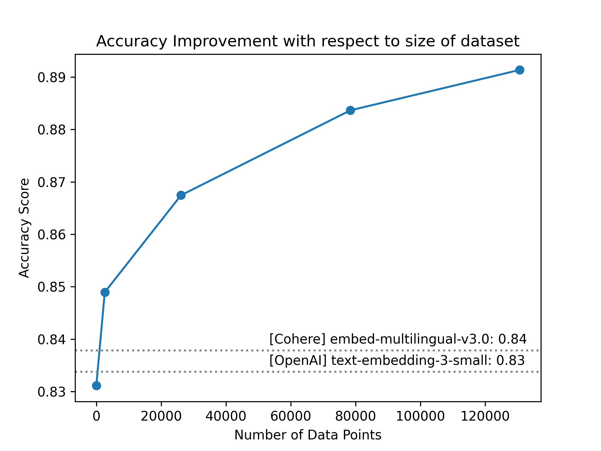

# Outline for Modal

## Introduction

- Our previous post emphasized the rapid embedding of data and its benefits for experimentation and iteration through parallelism.
- From my early work on multimodal embeddings in 2016, it's surprising to see the lack of fine-tuning and training in current embedding practices.
- It seems illogical to assume these embeddings are effective for our specific internal use cases without any customization.
- This post will demonstrate the use of model fine-tuning and, more critically, the application of grid search across various models and hyperparameters to identify the optimal model configuration.

## Goal for this blog post

- Demonstrating the process of fine-tuning open models with sentence transformers.
- Highlighting the importance and simplicity of fine-tuning domain-specific embedding models.
- Illustrating the capability of our approach to not only train a model but also to efficiently search across multiple models to identify the optimal one for your specific use case.

## Should we really have to finetune?

- We will demonstrate the use of embedding models to understand data dynamics.
- The performance of closed embeddings on the Quora similar question dataset will be examined.
- Subsequently, the performance of open-source models will be evaluated.
- A comparative table of AUC and accuracy for both closed and open models will be presented first.

## Duplicate Quora Questions

- The Quora question dataset serves as a straightforward example, focusing on the relevancy of whether two questions are similar.
- Within a retrieval-augmented generation (RAG) context, this would involve analyzing pairs of questions to determine the relevance of text chunks, regardless of the data's source. Essentially, it boils down to identifying pairs of relevant and irrelevant texts.

Other examples:

- Queries and relevant emails
- Queries and relevant documents
- Queries and relevant code snippets
- Queries and relevant images

- We'll show how the closed embeddings perform on the Quora similar question data set.
- Then we'll show how the open source models will perform.

## So, should we finetune?

If we have no data at all, it will often be the case that the open AI or the coherent models will do quite well. In the Quora duplicate data set, they perform quite well. 

| Model | Accuracy | AUC |
| ----- | -------- | --- |
| bge-base-en-v1.5 | 0.8311 | 0.8566 |
| text-embedding-3-small (OpenAI) | 0.8338 | 0.8612 |
| embed-multilingual-v3.0 (Cohere) | 0.8379 | 0.8619 |

What happens when we finetune? To measure this simply, we're going to fine-tune the same base model with more and more data and plot that against the accuracy. As you can see, just by having 2000, we can quickly outperform any closed source model. If you're a company with any amount of users and live traffic... It would only take a matter of days to generate this kind of data set.

If you had 200 users, asking 3-4 questions a day, you could easily generate this kind of data set in a matter of days.



This is the nature of every company that builds any kind of recommendation system before embeddings became super popular in 2022. Imagine a world where Amazon's book recommendations did not get better, regardless of whether or not you bought any of these books. Imagine Spotify or Netflix not getting any better even though you were watching more movies and listening to more music. By using data around whether you finished a whole movie or whether you skipped a song, all this information is used to improve how they train their embedding models. 

So why is that in these new applications? Do we assume that the data is fixed? 


## Now we know that we should finetune, how do we do it?

Training the best model involves several considerations:

- **Exploring Various Models:** Hugging Face offers a wide array of models, each with unique parameters such as context size, task performance, and model size.
- **Model Selection:** The key to finding the right model is experimentation. Trying out different models helps identify the best fit for your needs.
- **Considering Pricing:** Services like Pinecone factor in the number of dimension embeddings used, adding another layer to the decision-making process. Options range from as low as 64 dimensions to as high as 1500, similar to the old ada models. For instance, EDA 3 leverages Miroska embeddings to offer flexibility in selecting dimensionalities for the same model.
- **Budgeting for Training:** Given the budget for this exercise, we can afford to train multiple models. This enables us to employ a grid search strategy, testing various models across different dimensionalities.
- **Evaluating Against Data Volumes:** To understand the impact of data volume on model performance, we will test models against varying data sizes. This will help determine if certain models perform better with more or less data.

By addressing these points, we aim to identify and train the most effective model for our specific needs.

## What is Grid search?

- **Grid Search Overview**: A method for tuning hyperparameters to find the optimal combination for maximum performance. It involves:
  - Systematically working through multiple combinations of parameter tunes.
  - Cross-validating to determine the best performance tune.
  - Employing a full grid search for visualization purposes, though a random grid search may be more efficient in practice.
- **Tool Consideration**: Initially considered leveraging Optuna for a sophisticated search but found using Modal with its brute parallelism capabilities to be faster, albeit more costly, allowing for parallel testing of a wide array of models and configurations.
- **Variables to Explore**:
  - Acknowledgment of different variables not yet tried, including different loss functions, dimensionality, and learning rates.
- **Finetuning Multiple Models**:
  - Highlighting the potential to finetune many different models simultaneously.
  - Using a formula: models x n_dims x n_learning_rates x n_loss_functions \* dropout = many models!
  - Mention of finetuning many different models at once using a simple map.


```python
def generate_configs():
    for (
        model,
        sample_size,
        freeze_embedding_model,
        dense_out_features,
    ) in product(MODELS, DATASET_SIZE, [True], DENSE_OUT_FEATURES):
        yield ModelConfig(
            model_name=model,
            dataset_size=sample_size,
            freeze_embedding_model=freeze_embedding_model,
            dense_out_features=dense_out_features,
            learning_rate=1e-4,
            batch_size=32,
            warmup_steps=500,
            scheduler="warmuplinear",
            num_epochs=8,
        )
```
- For the purposes of this we train on everything but in practise you can imagine.
- We also found that in our experiments, training models where we do not freeze the model weights was significantly harder. It took a lot more time. So in this demo we'll always freeze the way it's effectively reducing this training problem to a linear adapter. [ 
- Dense out features here is the embedding size. 
- We did not experiment with the learning rate, batch size, and the warm-up schedule. 
- In production, we might also want to experiment with early stopping based on these last matters, but wanted to keep things consistent for the purposes of visualization. 

## Explore the data 

TODO

## Conclusion

TODO

## Future work

- Linear Adapters on closed source models (Which are easier to train but require some snapshotting of embeddings)
- Optuna or weight and biases for grid search which will loose some brute force parallelism for smarter more efficient search
