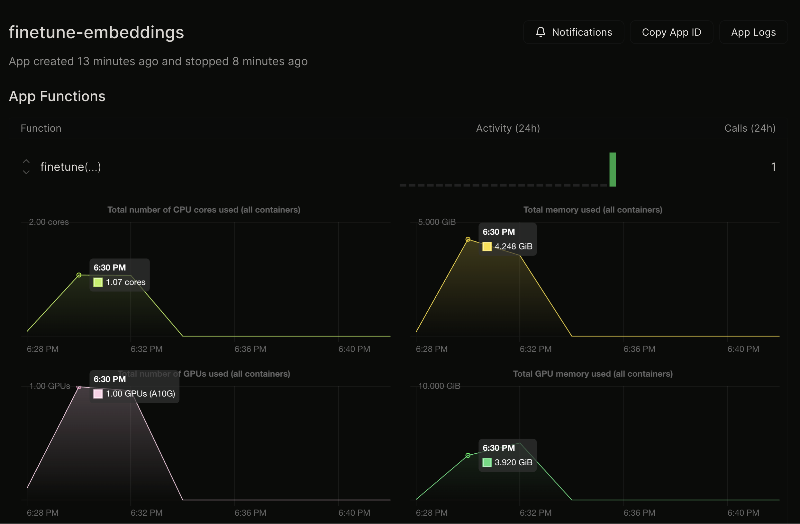

# Boost your RAG: Fine-Tuning Text Embedding Models on Modal

**TODO: make the intro better**

Using a base text embedding model + Vector DB is just the start for building a performant embedding system (i.e. for RAG). Each task that involves an embedding model is a unique one that can be fine-tuned.

Having an embedding model that is fine-tuned for your specific task can greatly improve performance. There are a few ways of going about this: picking a performant embedding model, having a robust dataset to train your specific task on, and choosing the right way to train your embedding model. In this article, we will discuss how to approach all of these and specifically how to fine-tune an open-source sentence embedding model using [`SentenceTransformers`](https://www.sbert.net/index.html) and [Modal](https://modal.com/). We will also cover how to do hyperparameter optimization using [Optuna](https://optuna.org/) on Modal to maximize your fine-tuning performance.

This article is the second in a series demonstrating how Modal can be effectively used with open-source embedding models, the first can be [found here](https://www.example.com). Through our tests, we've found that fine-tuning a base model can increase our performance from XX% to XX%, and further fine-tuning with hyperparameter optimization can increase it to XX%

**TODO: mention some metrics here**
**TODO: Mention sentencetransformers more**

## Fine-Tuning Basics

To begin fine-tuning a sentence transformer, we need to start by identifying the actual task we are trying to fine-tune for. Remember, every task is unique, so they require a unique dataset format, loss, and evaluator. We will be using the `SentenceTransformers` framework to easily set these requirements for fine-tuning.

For this article, we will be choosing the specific task of **Duplicate Text Classification**, i.e. given two questions, identify whether they are semantically duplicates. However, other tasks can be optimized for including information retrieval, duplicate statement mining, and more.

NOTE: Most of the instructions in this section are based on this excellent guide: <https://www.sbert.net/examples/training/quora_duplicate_questions/README.html>

### Choosing a Base Model

We will choose our open-source base model using the MTEB [Leaderboard](https://huggingface.co/spaces/mteb/leaderboard) as a reference. The MTEB (Massive Text Embedding Benchmark) Leaderboard lists the top-ranking Text Embedding models for different tasks. Since our task is duplicate text classification, we will be using the "Pair Classification" task to select a model.


Let's choose [`BAAI/bge-base-en-v1.5`](https://huggingface.co/BAAI/bge-base-en-v1.5) for this article.

**NOTE**: Some models on the leaderboard are potentially trained on test data of MTEB, which may lead to inaccurate metrics. Thus, it should only be used as a reference for selecting models. To remedy this, we will conduct hyperparameter optimization later in this article using the base model as a hyperparameter. [Details](https://twitter.com/Nils_Reimers/status/1738115869392146708)

We will begin by initializing our base model.

```python
from sentence_transformers import SentenceTransformer

model = SentenceTransformers("BAAI/bge-base-en-v1.5")
```

### Formatting our Dataset

The dataset we use is dependent on the **unique** task we have chosen. In this case, our dataset needs to be many pairs of texts each with a label stating if it's a duplicate or not. For this article, we will be using the [Quora Pairs Dataset](https://huggingface.co/datasets/quora) which is in our desired format.

Dataset format:

```json
{
    "is_duplicate": true,
    "questions": {
        "text": ["Is this a sample question?", "Is this an example question?"]
    }
}
```

Let's begin by importing our dataset and splitting it into a `train` and `test` split

```python
from datasets import load_dataset

dataset = load_dataset("quora", split="train") # quora dataset only contains a 'train split'
train_test_split = dataset.train_test_split(test_size=0.1)
train_dataset = train_test_split["train"]
test_dataset = train_test_split["test"]
```

Next, let's get into the correct format for the `SentenceTransformers` library. We will turn it into a list of `InputExample`, which is used to represent our training and test data. [source](https://www.sbert.net/docs/training/overview.html?highlight=inputexample#training-data)

```python
from sentence_transformers import InputExample

train_examples = [
  InputExample(
    texts=[
        train_dataset[i]["questions"]["text"][0],
        train_dataset[i]["questions"]["text"][1],
    ],
    label=int(train_dataset[i]["is_duplicate"]),
  )
  for i in range(train_dataset.num_rows)
]
test_examples = [
  InputExample(
    texts=[
        test_dataset[i]["questions"]["text"][0],
        test_dataset[i]["questions"]["text"][1],
    ],
    label=int(test_dataset[i]["is_duplicate"]),
  )
  for i in range(test_dataset.num_rows)
]
```

Nice! Our dataset is now in the correct format.

### Choosing a Loss Function

The loss function we choose is also dependent on our specific task. In our case, we will be using `OnlineContrastiveLoss` since it fits our task of duplicate pair classification. This is because contrastive loss functions by making sure that "Similar pairs with label 1 are pulled together, so that they are close in vector space. Dissimilar pairs, that are closer than a defined margin, are pushed away in vector space."[[SBERT docs]](https://www.sbert.net/examples/training/quora_duplicate_questions/README.html#constrative-loss).

We initialize our loss function using the base model we initialized earlier.

```python
from sentence_transformers import losses

train_loss = losses.OnlineContrastiveLoss(model)
```

### Choosing an Evaluator

The evaluation function we choose is also dependent on our specific task. In our case of duplicate air classification, we use `BinaryClassificationEvaluator`. This is because it's an evaluator that simply answers the question "Given (quesiton1, question2), is this a duplicate or not?"[[SBERT code]](https://github.com/UKPLab/sentence-transformers/blob/master/examples/training/quora_duplicate_questions/training_OnlineContrastiveLoss.py#L78-L93). It will be used to evaluate the training of our model.

We initialize the evaluator function using our test data

```python
from sentence_transformers import evaluation
evaluator = evaluation.BinaryClassificationEvaluator.from_input_examples(
    test_examples,
)
```

* choose a base model, loss, and evaluator

### Fine-Tuning the Model

Now that we have all of our pieces ready, we can finally train our model.

We first add our training data to a Pytorch `Dataloader`, which formats it into the structure needed to train our model. Then, we simply call the `model.fit()` function to fine-tune our base model using our data.

```python
from torch.utils.data import DataLoader

train_dataloader = DataLoader(train_examples, shuffle=True, batch_size=16)

# Just some code to enable logging for evaluation metrics
from sentence_transformers import LoggingHandler
import logging
logging.basicConfig(
    format="%(asctime)s - %(message)s",
    datefmt="%Y-%m-%d %H:%M:%S",
    level=logging.INFO,
    handlers=[LoggingHandler()],
)

model.fit(
  train_objectives=[(train_dataloader, train_loss)],
  evaluator=evaluator,
  epochs=10,
)

# Now, you can use the fine-tuned model just like any other SentenceTransformer model!
emb = model.encode("Hello world")
print("Embedding:", emb)
```

Nice! We've successfully fine-tuned a Sentenece Transformer. You should see logging code similar to this, which tells us the evaluation metrics of the training run at each epoch. Note that this code might take a long time on your local machine if it isn't built for machine learning. Let's speed this up with Modal!

```bash
✗ python main.py
Iteration: 100%|██████████████████████████████████████████████████████████████████| 46/46 [00:35<00:00,  1.28it/s]
2023-12-26 18:11:34 - Binary Accuracy Evaluation of the model on  dataset after epoch 0:                          
2023-12-26 18:11:35 - Accuracy with Cosine-Similarity:           77.50  (Threshold: 0.8958)                       
2023-12-26 18:11:35 - F1 with Cosine-Similarity:                 74.29  (Threshold: 0.8318)                       
2023-12-26 18:11:35 - Precision with Cosine-Similarity:          68.42                                            
2023-12-26 18:11:35 - Recall with Cosine-Similarity:             81.25                                            
2023-12-26 18:11:35 - Average Precision with Cosine-Similarity:  78.98                                            

2023-12-26 18:11:35 - Accuracy with Manhattan-Distance:           77.50 (Threshold: 10.0915)                      
2023-12-26 18:11:35 - F1 with Manhattan-Distance:                 73.17 (Threshold: 14.1923)                      
2023-12-26 18:11:35 - Precision with Manhattan-Distance:          60.00                                           
2023-12-26 18:11:35 - Recall with Manhattan-Distance:             93.75                                           
2023-12-26 18:11:35 - Average Precision with Manhattan-Distance:  77.72                                           

2023-12-26 18:11:35 - Accuracy with Euclidean-Distance:           77.50 (Threshold: 0.4564)                       
2023-12-26 18:11:35 - F1 with Euclidean-Distance:                 74.29 (Threshold: 0.5801)                       
2023-12-26 18:11:35 - Precision with Euclidean-Distance:          68.42                                           
2023-12-26 18:11:35 - Recall with Euclidean-Distance:             81.25                                           
2023-12-26 18:11:35 - Average Precision with Euclidean-Distance:  78.98                                           

2023-12-26 18:11:35 - Accuracy with Dot-Product:           77.50        (Threshold: 0.8958)                       
2023-12-26 18:11:35 - F1 with Dot-Product:                 74.29        (Threshold: 0.8318)                       
2023-12-26 18:11:35 - Precision with Dot-Product:          68.42                                                  
2023-12-26 18:11:35 - Recall with Dot-Product:             81.25                                                  
2023-12-26 18:11:35 - Average Precision with Dot-Product:  78.98  
```

**TODO: explain evals**

### Fine-Tuning with other tasks

We covered how to fine-tune an embedding model to perform well on one specific task: duplicate text classification. If you would like to fine-tune your model on other tasks, such as information retrieval or duplicate text mining, you may have to use a different dataset format, loss, and evaluator.

Here are some common tasks and their associated training methods

|       | Dataset Format | Loss          | Evaluator     |
|-------------------------------|----------------|---------------|---------------|
|**Duplicate Text Classification [src](https://github.com/UKPLab/sentence-transformers/blob/master/examples/training/quora_duplicate_questions/training_OnlineContrastiveLoss.py)**|Pairs of text that are may or may not be duplicate|[OnlineContrastiveLoss](https://www.sbert.net/docs/package_reference/losses.html#onlinecontrastiveloss)|[BinaryClassificationEvaluation](https://www.sbert.net/docs/package_reference/evaluation.html#sentence_transformers.evaluation.BinaryClassificationEvaluator)|
|**Information Retrieval [src](https://github.com/UKPLab/sentence-transformers/blob/master/examples/training/quora_duplicate_questions/training_MultipleNegativesRankingLoss.py)**|Pairs of text that are semantically relevant (don't need negatives)|[MultipleNegativesRankingLoss](https://www.sbert.net/docs/package_reference/losses.html#multiplenegativesrankingloss)|[InformationRetrievalEvaluator](https://www.sbert.net/docs/package_reference/evaluation.html#sentence_transformers.evaluation.InformationRetrievalEvaluator)|

## Fine-Tuning on Modal

Fine-tuning a sentence transformer can be slow on your local laptop, let's accelerate it with Modal. Modal is platform that allows you to run functions like AI workloads easily in the cloud. The infrastructure to do this simply takes a few lines of code to write.

In the below code, we simply wrap the previous code we wrote in a few lines of python to get it fully run on Modal's cloud platform

```python
import modal

# A stub is simply an object that defines everything that will be run in Modal
stub = modal.Stub("finetune-embeddings")

# We define the container image being used and install a few relevant pip packages
image = modal.Image.debian_slim().pip_install(
    "sentence-transformers", "torch", "datasets"
)

# Needed to store the trainig data as it stores. Note that a persisted volume lasts after the function finishes running, so you should remove it after you no longer need it.
volume = modal.Volume.persisted("finetune-embeddings-vol")

# This is the actual function that can be run on Modal, simply place your finetuning code in the function
@stub.function(
    image=image,
    gpu="a10g",
    timeout=15000,
    volumes={"/vol": volume},
    _allow_background_volume_commits=True,
)
def finetune():
    #### Simply copy-pasted the above fine-tuning code into this function
    from sentence_transformers import SentenceTransformer

    model = SentenceTransformer("BAAI/bge-base-en-v1.5")

    from datasets import load_dataset

    dataset = load_dataset(
        "quora", split="train"
    )  # quora dataset only contains a 'train split'
    train_test_split = dataset.train_test_split(test_size=0.1)
    train_dataset = train_test_split["train"]
    test_dataset = train_test_split["test"]

    from sentence_transformers import InputExample

    train_examples = [
        InputExample(
            texts=[
                train_dataset[i]["questions"]["text"][0],
                train_dataset[i]["questions"]["text"][1],
            ],
            label=int(train_dataset[i]["is_duplicate"]),
        )
        for i in range(train_dataset.num_rows // 100)
    ]
    test_examples = [
        InputExample(
            texts=[
                test_dataset[i]["questions"]["text"][0],
                test_dataset[i]["questions"]["text"][1],
            ],
            label=int(test_dataset[i]["is_duplicate"]),
        )
        for i in range(test_dataset.num_rows // 100)
    ]

    from sentence_transformers import losses

    train_loss = losses.OnlineContrastiveLoss(model)

    from sentence_transformers import evaluation

    evaluator = evaluation.BinaryClassificationEvaluator.from_input_examples(
        test_examples,
    )

    from torch.utils.data import DataLoader

    train_dataloader = DataLoader(train_examples, shuffle=True, batch_size=16)

    # Just some code to enable logging for evaluation metrics
    from sentence_transformers import LoggingHandler
    import logging
    logging.basicConfig(
        format="%(asctime)s - %(message)s",
        datefmt="%Y-%m-%d %H:%M:%S",
        level=logging.INFO,
        handlers=[LoggingHandler()],
    )

    model.fit(
      train_objectives=[(train_dataloader, train_loss)],
      evaluator=evaluator,
      epochs=10,
    )

# This is how we call the function to run remotely on Modal.
@stub.local_entrypoint()
def main():
    finetune.remote()
```

Now run the Modal app with `modal run <file_name>.py` to run it on Modal. (Note: create an account with Modal an go through their onboarding before this! <https://modal.com/>)

Visit the Modal Dashboard to see live metrics and logs of your Modal app.



As you can see, it's super easy to get started using GPUs in the cloud to run ML training jobs with Modal. A test training job I did took over 50 minutes on my personal Macbook Pro vs less than 4 minutes on Modal's serverless GPU.

## Fine-Tuning using Hyperparameter Optimization on Modal + Optuna

Fine-tuning using hyperparameter optimization (aka grid search) is a more advanced topic, however it can be very effective in tuning more performant models, including sentence transformer models. Modal is uniquely capable to do distributed hyperparameter optimizaton by using Modal's [NetworkFileSystem](https://modal.com/docs/guide/network-file-systems) feature with a hyperparameter framework, [Optuna](https://optuna.org/).

Basically, with Modal we can spin up dozens of serverless GPUs simulatneously to run dozens of hyperparameter tuning trials in parallel! Pretty cool, right?

### What is Optuna?

**TODO clarify how optuna works with trials**

Optuna is an open-source hyperparameter optimization framework designed for machine learning. It provides an efficient and easy-to-use interface for automatically searching for the best hyperparameters in your model training process. Specifically, how it works is it involves defining an objective function, in this case our loss, that is minimized for by testing a variety of hyperparameter combinations in various trials.

While this is a general technique used in machine learning, it is uniquely useful for fine-tuning sentence transformers as well. In addition to the standard hyperparameters we can optimize for the model, including learning rate, batch size, # of epochs, etc. it allows us to test some important hyperparameters specific to sentence transformers: the base embedding model and an optional linear layer.

Hyperparameters to test:

* Base Embedding Model: there are many different OSS embedding models and it's difficult to choose the right one. Testing multiple would help us find the most performant one for our specific task
* Optional Linear Layer Paramater Count: we can use a linear layer to help fine-tune our model and modify the output embedding dimension count using [sentence_transformers.models.Dense](https://www.sbert.net/docs/package_reference/models.html#sentence_transformers.models.Dense) This is useful for compressing our output embeddings to save space in a vector database
* Standard hyperparameters such as learning rate scheduler, batch size, # of epochs

### How do we use this with Modal?

**TODO link to repo**

Since the code for this is slightly more complicated than the simple fine-tuning we did previously, details can be found above.

The gist of it is that we are using Optuna with a [`JournalFileStorage`](https://optuna.readthedocs.io/en/stable/reference/generated/optuna.storages.JournalFileStorage.html#optuna.storages.JournalFileStorage) backend to store data from our multiple trials. `JournalFileStorage` allows us to use it with Network File System, or NFS.

Modal provides an [NFS resource](https://modal.com/docs/guide/network-file-systems) for us, which we instantiate with out stub. We then invoke multiple Modal Functions in parallel with Modal's `map()` ([details here](https://modal.com/docs/guide/scale)), provisioning GPU containers in parallel which act as workers for our distributed Optuna grid search. These workers test multiple trials in parallel
