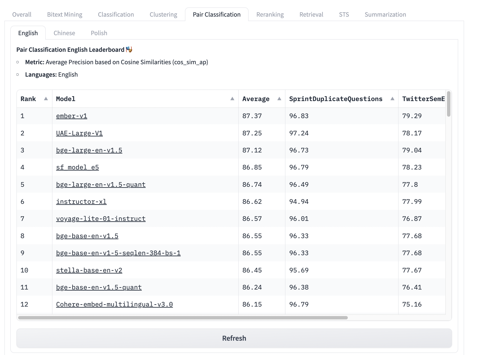

# Boost your RAG: Fine-Tuning Text Embedding Models on Modal

Using a base text embedding model + Vector DB is just the start for building a performant embedding system (i.e. for RAG). Each task that involves an embedding model is a unique one that can be fine-tuned.

Having an embedding model that is fine-tuned for your specific task can greatly improve performance. There are a few ways of going about this: picking a performant embedding model, having a robust dataset to train your specific task on, and choosing the right way to train your embedding model. In this article, we will discuss how to approach all of these and specifically how to fine-tune an open-source sentence embedding model using [`SentenceTransformers`](https://www.sbert.net/index.html) and [Modal](https://modal.com/). We will also cover how to do hyperparameter optimization using [Optuna](https://optuna.org/) on Modal to maximize your fine-tuning performance.

This article is the second in a series demonstrating how Modal can be effectively used with open-source embedding models, the first can be [found here](https://www.example.com). Through our tests, we've found that fine-tuning a base model can increase our performance from XX% to XX%, and further fine-tuning with hyperparameter optimization can increase it to XX%

**TODO: mention some metrics here**
** TODO: Mention sentencetransformers more***

## Fine-Tuning Basics

To begin fine-tuning a sentence transformer, we need to start by identifying the actual task we are trying to fine-tune for. Remember, every task is unique, so they require a unique dataset format, loss, and evaluator. We will be using the `SentenceTransformers` framework to easily set these requirements for fine-tuning.

For this article, we will be choosing the specific task of **Duplicate Questions Classification**, i.e. given two questions, identify whether they are semantically duplicates. However, other tasks can be optimized for including information retrieval, duplicate statement mining, and more. Details for this can be found [here](https://www.sbert.net/examples/training/quora_duplicate_questions/README.html).

### Choosing a Base Model

We will choose our open-source base model using the MTEB [Leaderboard](https://huggingface.co/spaces/mteb/leaderboard) as a reference. The MTEB (Massive Text Embedding Benchmark) Leaderboard lists the top-ranking Text Embedding models for different tasks. Since our task is duplicate question classification, we will be using the "Pair Classification" task to select a model.



Let's choose [`BAAI/bge-base-en-v1.5`](https://huggingface.co/BAAI/bge-base-en-v1.5) for this article.

**NOTE**: Some models on the leaderboard are potentially trained on test data of MTEB, which may lead to inaccurate metrics. Thus, it should only be used as a reference for selecting models. To remedy this, we will conduct hyperparameter optimization later in this article using the base model as a hyperparameter. [Details](https://twitter.com/Nils_Reimers/status/1738115869392146708)

We will begin by initializing our base model

```python
from sentence_transformers import SentenceTransformers

model = SentenceTransformers("BAAI/bge-base-en-v1.5")
```

### Formatting our Dataset

The dataset we use is dependent on the **unique** task we have chosen. In this case, our dataset needs to be many pairs of texts each with a label stating if it's a duplicate or not. For this article, we will be using the [Quora Pairs Dataset](https://huggingface.co/datasets/quora) which is in our desired format.

Dataset format:

```json
{
    "is_duplicate": true,
    "questions": {
        "text": ["Is this a sample question?", "Is this an example question?"]
    }
}
```

Let's begin by importing our dataset and splitting it into a `train` and `test` split

```python
from datasets import load_dataset

dataset = load_dataset("quora", split="train") # quora dataset only contains a 'train split'
train_test_split = dataset.train_test_split(test_size=0.1)
train_dataset = train_test_split["train"]
test_dataset = train_test_split["test"]
```

Next, let's get into the correct format for the `SentenceTransformers` library. We will turn it into a list of `InputExample`, which is used to represent our training and test data. [source](https://www.sbert.net/docs/training/overview.html?highlight=inputexample#training-data)

```python
from sentence_transformers import InputExample

train_examples = [
  InputExample(
    texts=[
        train_dataset[i]["questions"]["text"][0],
        train_dataset[i]["questions"]["text"][1],
    ],
    label=int(train_dataset[i]["is_duplicate"]),
  )
  for i in range(train_dataset.num_rows)
]
test_examples = [
  InputExample(
    texts=[
        test_dataset[i]["questions"]["text"][0],
        test_dataset[i]["questions"]["text"][1],
    ],
    label=int(test_dataset[i]["is_duplicate"]),
  )
  for i in range(test_dataset.num_rows)
]
```

Nice! Our dataset is now in the correct format.

### Choosing a Loss Function

The loss function we choose is also dependent on our specific task. In our case, we will be using `OnlineContrastiveLoss` since it fits our task of duplicate pair classification ([details here](https://www.sbert.net/examples/training/quora_duplicate_questions/README.html#constrative-loss)). It will be used as the function to optimize while training our model.

We initialize our loss function using the base model we initialized earlier.

```python
from sentence_transformers import SentenceTransformers, losses

train_loss = losses.OnlineContrastiveLoss(model)
```

### Choosing an Evaluator

The evaluation function we choose is also dependent on our specific task. In our case of duplicate air classification, we use `BinaryClassificationEvaluator`([details here](https://github.com/UKPLab/sentence-transformers/blob/master/examples/training/quora_duplicate_questions/training_OnlineContrastiveLoss.py#L78-L93)). It will be used to evaluate the training of our model.

We initialize the evaluator function using our test data

```python
from sentence_transformers import evaluation
evaluator = evaluation.BinaryClassificationEvaluator.from_input_examples(
    test_examples,
)
```

* choose a base model, loss, and evaluator

### Fine-Tuning the Model

Now that we have all of our pieces ready, we can finally train our model.

We first add our training data to a Pytorch `Dataloader`, which formats it into the structure needed to train our model. Then, we simply call the `model.fit()` function to fine-tune our base model using our data.

```python
from torch.utils.data import DataLoader

train_dataloader = DataLoader(train_examples, shuffle=True, batch_size=batch_size)

model.fit(
  train_objectives=[(train_dataloader, train_loss)],
  evaluator=evaluator,
  epochs=10,
)
```

### Fine-Tuning with other tasks

We covered how to fine-tune an embedding model to perform well on one specific task: duplicate question classification. If you would like to fine-tune your model on other tasks, such as information retrieval or duplicate text mining, you may have to use a different dataset format, loss, and evaluator.

Here are some common tasks and their associated training methods

**TODO: insert table about different tasks here**

## Fine-Tuning on Modal

**TODO: write this**

* write about how we can easily run this in the cloud with Modal stub and function, specify GPU and stuff, how to load it as a Huggingface compatible model

## Fine-Tuning using Hyperparameter Optimization on Modal + Optuna

**TODO: write this**

* NFS, use as the backend for Optuna
* Objective function, this is what we optimize
